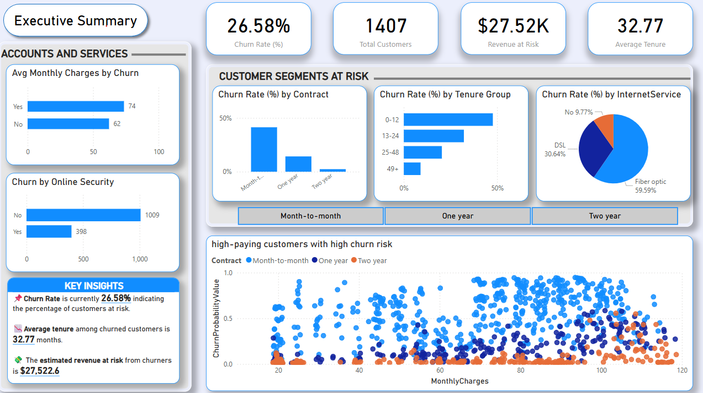

# 📉 Customer Churn Prediction Project

This repository contains a complete pipeline for predicting customer churn using the **IBM Telco Customer Churn** dataset with a **Story telling** setting. It combines detailed exploratory data analysis, feature engineering, multiple modeling strategies, predictive analysis, and business visualization through **Power BI**.

---

## 🚀 Project Highlights

- 📊 **EDA Notebook**: Uncovers customer segments most likely to churn using visualizations and statistical summaries. Check out the images folder to get a glimpse of EDA plots.
- 🧠 **Modeling Notebook**: Tests multiple models — from logistic regression to tuned XGBoost — with extensive feature engineering.
- 📈 **Power BI Dashboard**: Visualizes real-time churn patterns, risk segments, and monetary loss.

---

## 🧪 Final Model Comparison


| Model                          | Accuracy | Precision | Recall | F1 Score | ROC-AUC |
|-------------------------------|----------|-----------|--------|----------|---------|
| Logistic Regression (baseline)         | 0.796    | 0.635     | 0.55   | 0.588    | 0.840   |
| Logistic Regression (engineered)       | 0.793    | 0.635     | 0.48   | 0.552    | 0.8313  |
| Random Forest (default)               | 0.788    | 0.640     | 0.47   | 0.540    | 0.8187  |
| XGBoost (default)                     | 0.787    | 0.620     | 0.50   | 0.556    | 0.8237  |
| **XGBoost (tuned + threshold 0.44)**  | **0.749** | **0.520** | **0.75** | **0.614** | **0.8318** |
| SVM (default)                         | 0.791    | 0.650     | 0.47   | 0.543    | 0.7842  |
| SVM (tuned)                           | 0.790    | 0.640     | 0.47   | 0.542    | 0.7849  |


🔍 **XGBoost (tuned)** showed the best F1 score and recall — ideal for capturing high-risk churners.  
✅ Logistic Regression also performed well and offers interpretability.  
📉 SVM lagged in performance despite tuning.

---

## 🖼️ Power BI Dashboard Overview



- **Churn Rate**: 26.58%
- **Revenue at Risk**: \$27,522.6
- **High-Risk Contracts**: Month-to-Month users, Fiber Optic internet users, no Online Security
- **Average Tenure**: 32.77 months

---

## 🛠️ Getting Started

Follow these steps to set up and run the project locally:

### 1. Clone the Repository

```bash
git clone https://github.com/Srivatsa0411/customer_churn.git
cd customer_churn
```
### 2. Create and Activate Virtual Environment (Recommended)
```bash
python -m venv .venv
source .venv/bin/activate        # On Windows: .venv\Scripts\activate
```

### 3. Install Dependencies
```bash
pip install -r requirements.txt
```
### 4. Launch Jupyter and Explore
```bash
jupyter notebook
```
Open the notebooks from the `notebooks/` folder:

`churn_eda.ipynb` → for exploratory analysis

`churn_modeling.ipynb` → for model training and evaluation

### 5. View Power BI Dashboard
Open `Customer Churn Dashboard.pbix` in Power BI Desktop.
Ensure the visuals render correctly (they use precomputed CSVs from `data/`).

---

## 📁 Repository Structure

```
CUSTOMER_CHURN/
├── data/
│    ├── final_predicitions.csv
│    └── processed_telco_data.csv
├── images/
│    ├── bivariate/ # EDA Bivariate plots (Churn vs Features)  
│    ├── univariate/ # EDA Distribution plots
│    ├── feature_correlation_heatmap.png
│    ├── missing_data_matrix.png
│    └── powerbi_dashboard.png
├── notebooks/
│   ├── churn_eda.ipynb
│   └── churn_modeling.ipynb
├── Customer Churn Dashboard.pbix
├── requirements.txt
├── LICENSE
└── README.md
```

---

## ✅ Business Takeaways

- Customers with **short tenure**, **high monthly charges**, and **limited services** are at highest churn risk.
- Churn mitigation strategies should target **month-to-month** subscribers with **fiber internet** but **no tech support**.
- XGBoost with feature engineering and threshold tuning offers **best balance** between recall and precision — crucial for churn prediction.

---

## 📊 Next Steps

- Deploy top model with Streamlit or Flask
- Add SHAP value analysis for interpretability
- Monitor model performance on live data

---

### 📚 Data Source

- IBM Telco Churn dataset via [Kaggle](https://www.kaggle.com/blastchar/telco-customer-churn)

---

### 📌 Author

Built by Srivatsa — showcasing practical machine learning with real-world business application.

---

### License

MIT license
